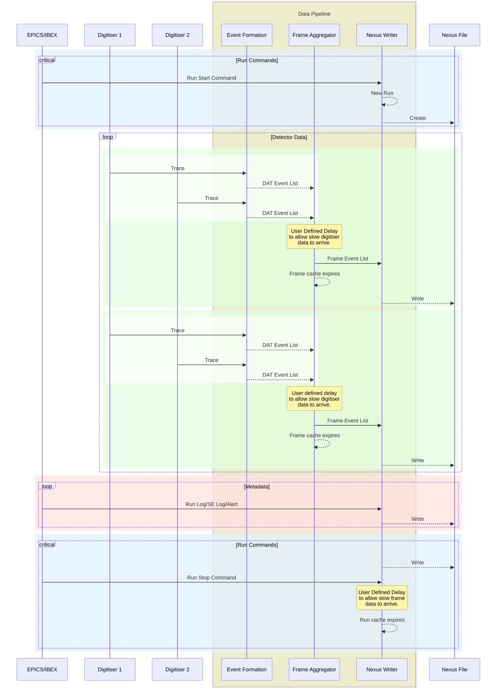

# Super MuRS Data Pipeline

Each message is uniquely identified by the following:
- Digitiser Trace: (Dig. ID, Frame Metadata)
- Digitiser Event List: (Dig. ID, Frame Metadata)
- Frame Event List: (Frame Metadata)

