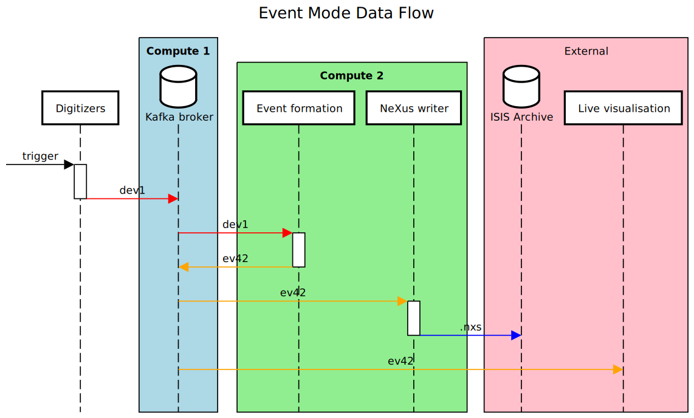

# Event Mode

## "Compute 2" sidecar applications

### Event formation

Responsible for:

- Ensuring a given run starts and ends on the same frame
   - Mitigates staggard start/end across all digitizers
- Ensuring no frame inconsistencies mid run
   - e.g. for a given frame, if any one digitizer does not report data, drop data from all digitizers
- Deduplication of status packet data and formation of sample logs

This is a custom application that will need to be developed.

Ideally, this will output an [`ev42` format](https://github.com/ess-dmsc/streaming-data-types/blob/master/schemas/ev42_events.fbs) event stream.

### NeXus writer

Responsible for writing NeXus files to disk given a data stream.
[Developed by the ESS](https://github.com/ess-dmsc/kafka-to-nexus), most likely can be used off the shelf with no modifications.
