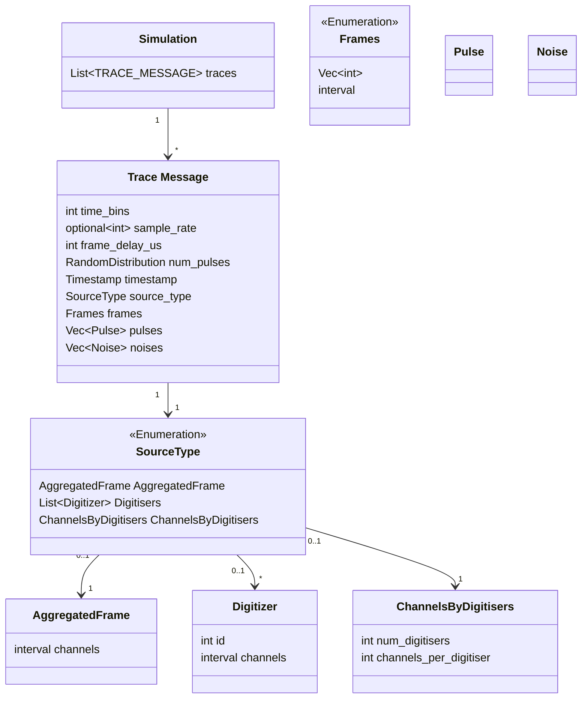

# Simulation Class Diagram

```mermaid
classDiagram
    class SIMULATION ["Simulation"] {
        List~TRACE_MESSAGE~ traces
    }
    class TRACE_MESSAGE ["Trace Message"] {
        int time_bins
        optional~int~ sample_rate
        int frame_delay_us
        RandomDistribution num_pulses
        Timestamp timestamp
        SourceType source_type
        Frames frames
        Vec~Pulse~ pulses
        Vec~Noise~ noises
    }
    SIMULATION "1" --> "*" TRACE_MESSAGE
    class SOURCE_TYPE ["SourceType"] {
        <<Enumeration>>
        AggregatedFrame AggregatedFrame
        List~Digitizer~ Digitisers
        ChannelsByDigitisers ChannelsByDigitisers
    }
    SOURCE_TYPE "0..1" --> "1" AGGREGATED_FRAME
    class AGGREGATED_FRAME ["AggregatedFrame"] {
        interval channels
    }
    SOURCE_TYPE "0..1" --> "*" DIGITIZER
    class DIGITIZER ["Digitizer"] {
        int id
        interval channels
    }
    SOURCE_TYPE "0..1" --> "1" CHANNELS_BY_DIGITIZER
    class CHANNELS_BY_DIGITIZER ["ChannelsByDigitisers"] {
        int num_digitisers
        int channels_per_digitiser
    }
    TRACE_MESSAGE "1" --> "1" SOURCE_TYPE
    class FRAMES ["Frames"] {
        <<Enumeration>>
        Vec~int~
        interval

    }
    class PULSE ["Pulse"] {

    }
    class NOISE ["Noise"] {

    }
```
