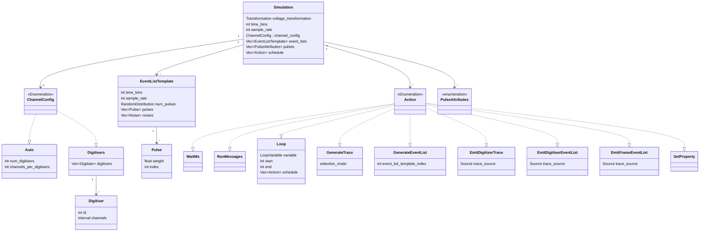

# Simulation Class Diagram



```mermaid
    SOURCE_TYPE "0..1" --> "*" DIGITIZER
    class DIGITIZER ["Digitizer"] {
        int id
        interval channels
    }
    SOURCE_TYPE "0..1" --> "1" CHANNELS_BY_DIGITIZER
    class CHANNELS_BY_DIGITIZER ["ChannelsByDigitisers"] {
        int num_digitisers
        int channels_per_digitiser
    }
    TRACE_MESSAGE "1" --> "1" SOURCE_TYPE
    class FRAMES ["Frames"] {
        <<Enumeration>>
        Vec~int~
        interval

    }
    class PULSE ["Pulse"] {

    }
    class NOISE ["Noise"] {

    }
```
