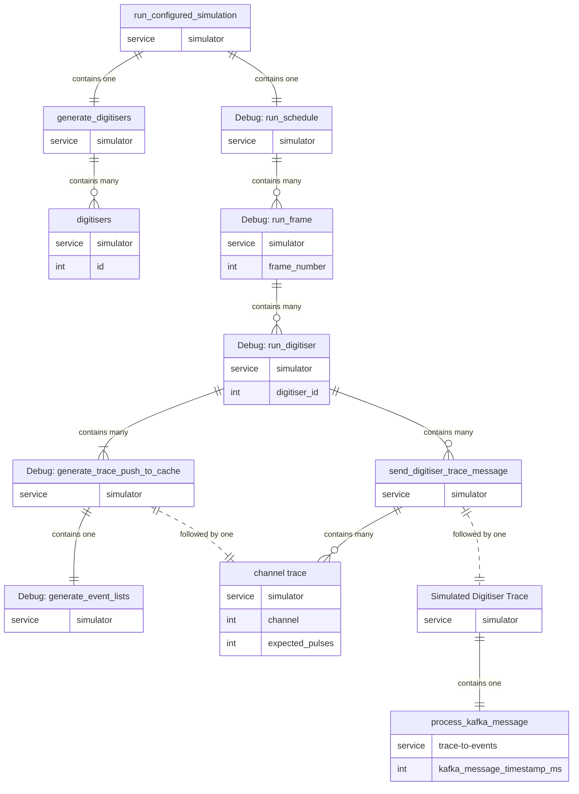
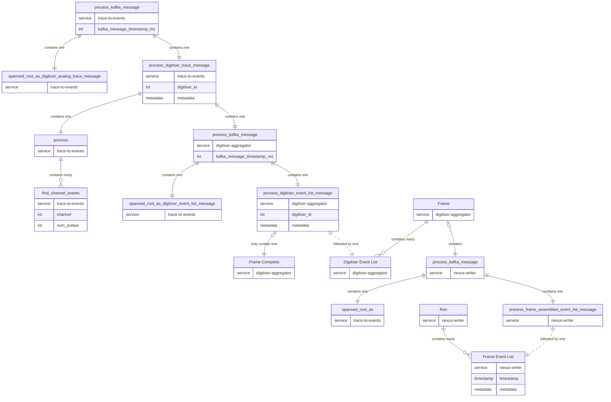

# Policy on using Tracing and OpenTelemetry in the SuperMuSR Data Pipeline

This document describes how tracing is used in the SuperMuSR Data Pipeline, it is not intended as an introduction to tracing or the tracing crate. Please see appropriate documentation or tutorials if necessary.

## Introduction

As the data pipeline works via the interaction of several independent processes, communicating via a common broker, determining cause and effect can be tricky.

### Terminology

|Term|Definition|
|---|---|
|Tracing|This refers both to the technique of collecting structured, hierarchical and temporal data from software, as well as the rust crate which implements it|
|OpenTelemetry|This is a layer of software which collects tracing data from different processes and allows them to be linked causally.|
|Jaeger|This is a third-party `collector` of tracing data that can collect, store and display traces in a meaningful manner.|
|Trace|In OpenTelemetry a trace is a rooted tree of spans, however in general, a `trace` is either a span or an event. |
|Span|A span is an interval of time in which a program does some work, for instance, a function execution. Spans are used to track the flow of data through the pipeline.|
|Event|A singlular moment within a span in which an event occured, also called a `log`. Events are mostly used to record error messages.|
|Field|A key/value pair which can be a propery of a span or event. For instance metadata of received flatbuffer messages are recorded in fields.|
|Subscriber|A subscriber collects traces for specific targets at specific levels and outputs them in a subscriber-specific way. The data pipeline uses a subscriber which outputs traces to stdout, and a subscriber which delivers traces to Jaeger. The tracing level of each can be specified separately by environment variables.|
|Service|A service is roughly synonymous with a process, or component of the pipeline. The child/parent relationships of spans can cross service boundaries, for instance the trace-to-events component and digitiser-aggregator.|

## Tracing Levels

Tracing levels refer to the severity of the span or event being created. If a subscribe records tracing data at level `INFO` then it records all tracing data at or below the `INFO` level. That is a lower number indicates a higher priority.

These can be one of:

|Priority|Level|Usage|Example|
|---|---|---|---|
|1|Error|When a state arises which either results in the termination of the program or significantly affects its smooth running.|An incorrect configuration is given during start-up.|
|2|Warn|When a state arises which prevents the program doing its job properly, but could be recoverable in the future.|A corrupted or unidentifiable Kafka message, or series of invalid Run commands.|
|3|Info|To indicate the normal running of the program at a coarse-grained level, as well as collate spans from other components.|The `Run` span in the `nexus-writer` tool which links to all traces relevant to the same run.|
|4|Debug|For events and spans which may assist in debugging issues. Generally low priority.|Details of event formation|
|5|Trace|For the most fine-grained spans and traces. Generally each and every function should be instrumented at the trace level.|IO, or disk write functions|

## Subscribers

## Target

Targets are used by subscribers to determine which traces to consume. Each subscriber has an associated level for each target and consumes all traces directed at that target at or below that level.

Each module has its own target by default, and if no target is specified, traces are directed towards the module target.

In addition to the module targets, some traces and spans are targeted at `otel` to indicate these should only be consumed by the OpenTelemetry subscriber.

## Instrumenting Functions

This section describes the use of the `#[tracing::instrument]` macro placed over functions. Using the macro is preferred over defining spans directly. If necessary, the `name` field can be overridden.

Every function that can fail should be instrumented (i.e. that has return type `Result<>`), and should have use `err(level = WARN)` or `err(level = ERROR)` depending on the type of error.

## Diagrams

The following diagrams define all spans which exist at the `INFO` level (and some at use at the `DEBUG` level, though not all). The first one shows the span structure in the simulator (not part of the data-pipeline). If Kafka messages are simulated, then the `process_kafka_message` which begins the `trace-to-events` component will have the final `Simulated Digitiser Trace` span as parent.

### Simulator

This diagram shows the normal structure of the simulator running in `defined` mode setup to generate digitiser trace messages. Please refer to [Mermaid documentation](https://mermaid.js.org/syntax/entityRelationshipDiagram.html#relationship-syntax) for an explanation of the connecting symbols.

### Data Pipeline

Let us define `metadata` as the fields:

|Type|Name|
|---|---|
|DateTime|timestamp|
|int|frame_number|
|int|period_number|
|int|veto_flags|
|int|protons_per_pulse|
|bool|running|

These fields correspond either to Frame Event List metadata, Digitiser Event List metadata, or Digitiser Trace metadata, depending on context.

### Digitiser Trace Message Arrives in Event Formation

### Digitiser Event Message Arrives in Digitiser Aggregator

### Frame Event Message Arrives in Nexus Writer

