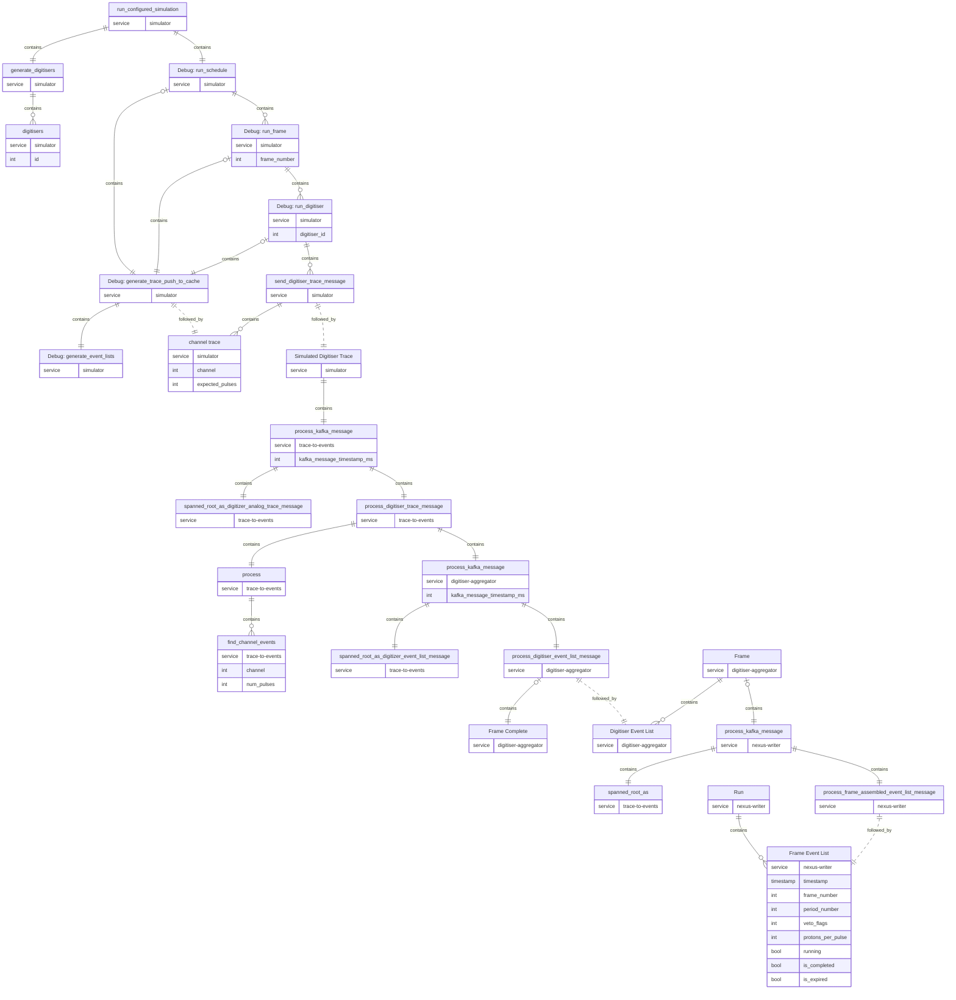

# Policy on using tracing, metrics and logging

## Tracing Levels

Tracing levels refer to the severity of the span or event being created. These can be one of:

1. Error
1. Warn
1. Info
1. Debug
1. Trace

### Error

This is to be used when a state arises which either results in the termination of the program or significantly affects its smooth running. For instance, if incorrect an configuration is given during start-up, or [TODO]

### Warn

This is to be used when a state arises which prevents the program doing its job properly, but could be recoverable in the future. For instance, a corrupted or unidentifiable kafka message, or series of invalid Run commands.

### Info

This is to be used to indicate the normal running of the program at a coarse-grained level, as well as collate spans from other components. For instance, the `Run` span in the `nexus-writer` tool which links to all traces relevant to the same run.

### Debug

This is for events and spans which may assist in debugging issues. Generally low priority. For instance, details of event formation.

### Trace

This is for the most fine-grained spans and traces. Generally each and every function should be instrumented at the trace level.

## Instrumenting Functions

This section describes the use of the `#[tracing::instrument]` macro placed over functions.

Every function that can fail should be instrumented (i.e. that has return type `Result<>`).

## Services

Services in Open Telemetry are the highest level category of traces.

Each component has its own service, which takes its name from the component module name, namely:

- nexus-writer
- digitiser-aggregator
- trace-to-events
- simulator
- run-simulator
- trace-archiver-hdf5
- trace-archiver-tdengine
- kafka-daq-report
- trace-reader

## Targets

Targets are used by subscribers to determine which traces to consume. Each subscriber has an associated level for each target and consumes all traces directed at that target at or below that level.

Each module has its own target by default, and if no target is specified, traces are directed towards the module target.

In addition to the module targets, some traces and spans are targeted at `otel` to indicate these should only be consumed by the OpenTelemetry subscriber.

## Diagrams

Let us define `metadata` as the fields:

- timestamp
- frame_number
- period_number
- veto_flags
- protons_per_pulse
- running

These fields correspond either to Frame Event List metadata or Digitiser Event List metadata depending on context.

### Run Span

### Digitiser Trace Message Arrives in Event Formation

### Digitiser Event Message Arrives in Digitiser Aggregator

### Frame Event Message Arrives in Nexus Writer

